# 🏗️ Architecture Overview – PlanBCore

This document provides a **living overview** of the PlanBCore architecture.  
It is intended to give new contributors a rapid understanding of the system’s structure, major components, and design principles.  
Keep this document updated as the project evolves.

---

## 1. Project Structure
```bash
[Project Root]/
├── .github/              # GitHub configs (CI, PR templates)
├── apps/                 # Core applications
│   ├── api/              # Core API service (Go)
│   │   ├── cmd/          # Application entrypoint
│   │   ├── config/       # API configuration files
│   │   ├── internal/     # Clean architecture layers
│   │   │   ├── delivery/ # HTTP handlers, routes
│   │   │   ├── usecase/  # Business logic
│   │   │   ├── repository/ # DB adapters (Postgres)
│   │   │   └── domain/   # Entities and contracts
│   │   ├── migrations/   # Database migrations
│   │   └── Dockerfile
│   │
│   ├── agent/            # Remote agent (Go) installed on servers
│   │   ├── cmd/          # Application entrypoint
│   │   ├── config/       # Agent configuration
│   │   ├── internal/     # Clean architecture layers
│   │   │   ├── delivery/ # Local API or system adapters
│   │   │   ├── usecase/  # Agent tasks (status, heartbeat)
│   │   │   ├── repository/ # Optional storage
│   │   │   └── domain/
│   │   └── Dockerfile
│   │
│   └── frontends/        # Frontend apps
│       └── landingpage/  # Public web interface
│           ├── src/      # React/Vite code
│           └── package.json
│
├── docs/                 # Documentation
│   ├── ARCHITECTURE.md   # This document
│   └── README.md
│
├── infra/                # Infrastructure and scripts
│   ├── proxy/            # Proxy configuration (nginx, caddy)
│   └── scripts/          # Automation (create-env, etc.)
│
├── libs/                 # Shared libraries
│   └── go/core/          # Shared Go modules (auth, logger, etc.)
│
├── .env                  # Environment variables
├── docker-compose.yml    # Local dev orchestration
├── Makefile              # Common build/run shortcuts
└── README.md             # Project overview
```
## 2. High-Level System Diagram

